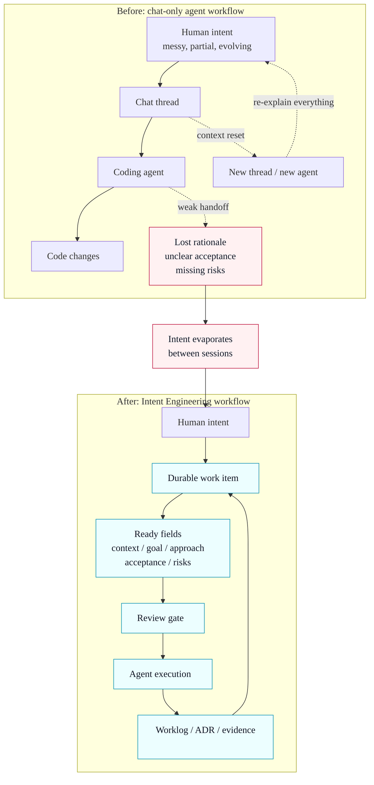

# kano-agent-backlog-skill

[](LICENSE)
[](https://agentskill-backlog.kanohorizonia.com/)

Intent Engineering for AI coding agents: turn ambiguous human intent into durable, reviewable, executable work items that live with the repository.

`kano-agent-backlog-skill` is a local-first backlog and work item layer for that practice. It stores the context, goal, approach, acceptance criteria, risks, decisions, worklogs, and handoff trail as plain markdown so humans and agents can review the same source of truth.

## Public thesis: Intent Engineering

The problem is not that AI agent teams have no backlog. The problem is that human intent keeps evaporating between chat, coding agents, CI logs, review comments, and the next thread.

This repo frames **Intent Engineering** as the discipline of turning ambiguous, partial, evolving human intent into durable work items that an AI agent can execute and a maintainer can review.

Related practices solve different parts of the agent workflow:

| Practice | Main question | Durable artifact |
| --- | --- | --- |
| Prompt Engineering | How do I ask the model clearly right now? | Prompt text |
| Context Engineering | What information should the model see? | Curated context window |
| Loop Engineering | How does the agent iterate, test, and recover? | Execution loop and feedback policy |
| Intent Engineering | What should survive chat and guide work across agents? | Reviewable work item with acceptance and evidence |

`kano-agent-backlog-skill` focuses on the intent layer. It is not a full AgentOS runtime: it does not schedule agents, host models, replace CI, or own the whole execution platform. A broader AgentOS-style maintainer workflow is a useful long-term direction, but it is secondary to the current OSS contract: local files plus a native CLI for durable work items and evidence.

## The problem



Instead of sending agents directly from chat to code, `kano-agent-backlog-skill` inserts a durable intent layer between discussion and execution.

## Why this exists

Most agent workflows still depend on fragile chat memory. That breaks down when you need to answer basic questions later, like why a task was split, what was accepted, which risk was known, or what the next agent should do.

`kano-agent-backlog-skill` exists to make agent work local first, reviewable, and recoverable. Instead of treating planning as disposable chat, it turns backlog items, ADRs, worklogs, and release evidence into repo assets that first-time users can inspect with normal Git and Markdown tools.

## Native implementation direction

The repo-local executable contract is the native C++ CLI. The `scripts/kob` and `scripts/kano-backlog` launchers require a locally built native binary and no longer fall back to Python. The old Python runtime and pytest oracle have been removed from this repo; native C++ smoke tests and release gates are the supported verification surface.

## What it provides

- Markdown backed work items with frontmatter and stable IDs
- Ready gate fields for context, goal, approach, acceptance criteria, and risks
- Append only worklogs for execution history and handoff notes
- ADR support for durable technical decisions
- Worksets and topics for focused execution and multi-agent coordination
- Release evidence, views, and validation surfaces that stay in the repository
- Optional search and embedding flows, clearly marked as experimental

## Current release status

- [GitHub Releases](https://github.com/kanohorizonia/kano-agent-backlog-skill/releases) is the source of truth for installable public artifacts
- [Latest public CI test report](https://agentskill-backlog.kanohorizonia.com/reports/latest/test-report/) is the source of truth for reviewable test and BDD evidence
- [Latest public coverage report](https://agentskill-backlog.kanohorizonia.com/reports/latest/coverage-report/) publishes source-level coverage for this open-source project
- `0.0.4` is the current native C++ release target and is accepted only when `v0.0.4` exists with downloadable platform artifacts
- `0.0.2` is the previous tagged OSS release
- `0.0.3` was an untagged Python-public planning line and is superseded by `0.0.4`
- repo-local CLI usage is native C++ only
- Python package publishing is retired for this milestone
- Pre-1.0, so schema, CLI details, and public docs can still change

## Agent-skill release acceptance gate

These gates are shared by Kano agent-skill releases, not just this repository:

1. A version is not accepted as released until a non-draft GitHub Release exists for the version tag with downloadable, installable platform artifacts, integrity metadata, and an artifact index from the matching Jenkins `Build_CI` source/version.
2. The repository README and public GitHub Pages site must both link the release downloads and describe manual installation plus winget, Homebrew, and apt channel status for each supported platform.

Internal CI archives, dry-run `Release_Publish` runs, or staged payloads are review evidence, but they do not close the public release gate without those two public surfaces.

## Install from a release

Download packages from the [latest GitHub Release](https://github.com/kanohorizonia/kano-agent-backlog-skill/releases/latest). For the 0.0.4 line, the expected release tag is [`v0.0.4`](https://github.com/kanohorizonia/kano-agent-backlog-skill/releases/tag/v0.0.4).

Each release must publish platform artifacts and checksum/index metadata from the matching Jenkins `Build_CI` source version. If the release page or assets are missing, that version has not passed the release gate yet.

Manual install baseline:

```bash
# Linux or macOS: choose the archive matching your platform and CPU.
mkdir -p "$HOME/.agents/skills/kano-agent-backlog-skill"
tar -xzf KanoHorizonia.KanoBacklog-<platform>-main-<version>-Release-cli.tar.gz \
  -C "$HOME/.agents/skills/kano-agent-backlog-skill" --strip-components 1
export PATH="$HOME/.agents/skills/kano-agent-backlog-skill/scripts:$PATH"
kob --version
kob doctor
```

On Windows, use the Windows archive from the same release and add the extracted `scripts` directory to `PATH`; when an MSI is published for a release, prefer the MSI because it performs the skill install and PATH setup.

Package-manager channels:

- winget: planned package ID `KanoHorizonia.KanoBacklog`; use only after the release publishes winget metadata.
- Homebrew: planned formula `kano-backlog` in an owned Kano tap; `homebrew-core` is not used for the 0.0.4 validation path.
- apt: planned owned apt repository; no public apt repository is live until release metadata and repository indexes are published.

The GitHub Pages site also carries the same download and package-manager status in [Installation](https://agentskill-backlog.kanohorizonia.com/guides/installation) and [Release Channels](https://agentskill-backlog.kanohorizonia.com/guides/release-channels).

## Quick start

Build the native CLI from a cloned repository, then use the repo-local launcher:

```bash
pixi run build-dev
bash scripts/kob admin init --product my-app --agent codex
bash scripts/kob item create --type task --title "Add login" --product my-app --agent codex
bash scripts/kob doctor
```

If you are working from a clone, start with [docs/agent-quick-start.md](docs/agent-quick-start.md). The repo-local launcher is `bash scripts/kob`; it routes to the native binary only.

## Backlog webview with Docker Compose

When the host-native webview binary is missing or blocked, start the read-only webview through Docker Compose:

```bash
pixi run webview-compose-up-detached
```

Then open <http://localhost:8799/>. The compose service mounts the shared backlog at `../_kano/backlog` and serves it from inside the container. Stop it with:

```bash
pixi run webview-compose-down
```

To run it in the foreground for logs:

```bash
pixi run webview-compose-up
```

## Documentation

- [GitHub Pages documentation site](https://agentskill-backlog.kanohorizonia.com/)
- [Latest public CI test report](https://agentskill-backlog.kanohorizonia.com/reports/latest/test-report/)
- [Latest public coverage report](https://agentskill-backlog.kanohorizonia.com/reports/latest/coverage-report/)
- [Quick start](docs/quick-start.md)
- [Installation](docs/installation.md)
- [Configuration](docs/configuration.md)
- [Version policy](docs/version-policy.md)
- [Release channels](docs/release-channels.md)
- [Native CLI direction](docs/design/native-cli-direction.md)
- [Maintainer automation](docs/maintainer-automation.md)
- [Codex for OSS](docs/codex-for-oss.md)
- [Agent quick start](docs/agent-quick-start.md)
- [Usage examples](docs/usage-examples.md)
- [Worksets](docs/workset.md)
- [Topics](docs/topic.md)
- [Experimental features](docs/experimental-features.md)
- [Workflow reference](references/workflow.md)
- [Schema reference](references/schema.md)
- [REFERENCE.md](REFERENCE.md)
- [SKILL.md](SKILL.md)
- [CHANGELOG.md](CHANGELOG.md)

## Demo

A companion demo repo exists at [dorgonman/kano-agent-backlog-skill-demo](https://github.com/dorgonman/kano-agent-backlog-skill-demo).

It demonstrates the multi-agent adapter layout and a sample backlog workspace. This repo does not bundle that demo, so treat it as a separate example workspace. See [docs/demo-maintenance.md](docs/demo-maintenance.md) for the follow-up checklist used when the demo checkout is unavailable locally.

## GitHub Pages

Published docs live at [agentskill-backlog.kanohorizonia.com](https://agentskill-backlog.kanohorizonia.com/).

## Codex for OSS relevance

This project is aimed at open source maintainers and agent heavy teams who need more than generated code. It helps Codex style and other coding agents work against durable repo state instead of fading conversation state.

That matters for OSS review because maintainers need artifacts they can inspect in pull requests, not just claims from a previous chat. The backlog, ADR, worklog, and release evidence model is built around that review loop.

- issue triage and task refinement survive beyond chat history
- acceptance criteria and Ready Gate fields stay reviewable in markdown
- ADRs and worklogs preserve technical decisions for maintainers and future agents
- release notes, changelog inputs, and evidence snapshots stay attached to the repo
- multi-agent handoff is grounded in shared backlog artifacts instead of prompt reconstruction

## Validation

Validation here means keeping execution tied to explicit acceptance and visible evidence.

- Ready gate fields make tasks reviewable before coding starts
- `kano-backlog doctor` checks environment and backlog health
- Worklogs and release artifacts keep a visible trail of what changed and why
- References and generated views keep human review and agent handoff aligned

Recommended commands:

```bash
bash src/shell/test/quick-test.sh
bash src/shell/test/lint.sh
bash src/shell/support/show-version.sh
bash src/shell/support/self-build.sh debug
bash src/shell/test/native-test.sh
bash scripts/kob --version
bash scripts/kob doctor
```

## Experimental areas

Experimental work is present, but not sold as stable.

- Search and embedding flows
- Some advanced querying and tokenizer diagnostics
- Other surfaces called out in [docs/experimental-features.md](docs/experimental-features.md)

## License and contributing

Licensed under [MIT](LICENSE).

If you want to contribute, start with [CONTRIBUTING.md](CONTRIBUTING.md). For issues and feature requests, use the [GitHub issue tracker](https://github.com/kanohorizonia/kano-agent-backlog-skill/issues).
