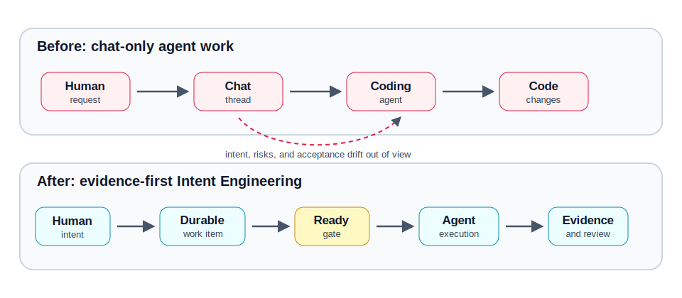
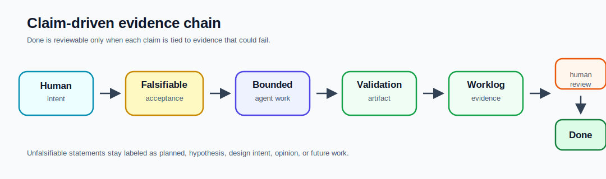
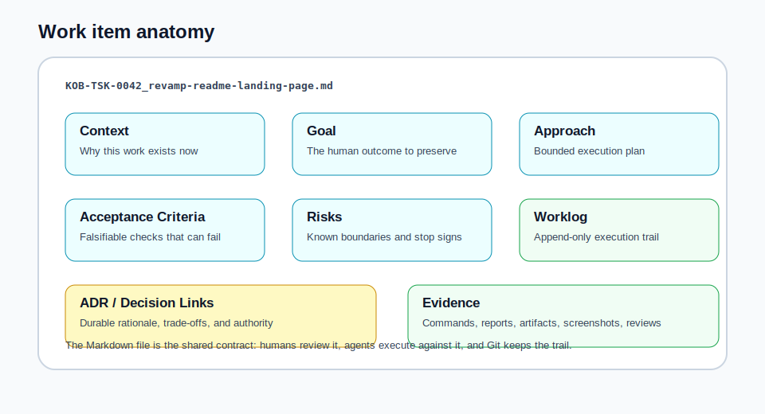
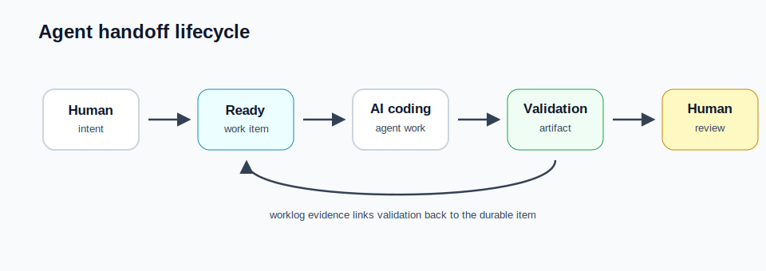
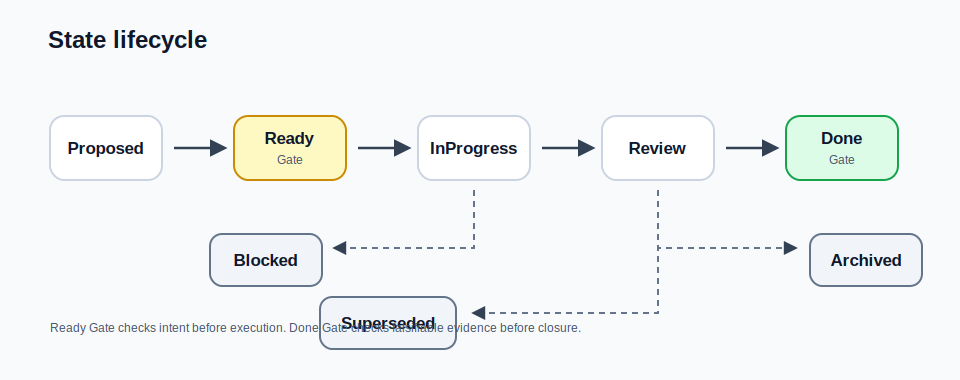
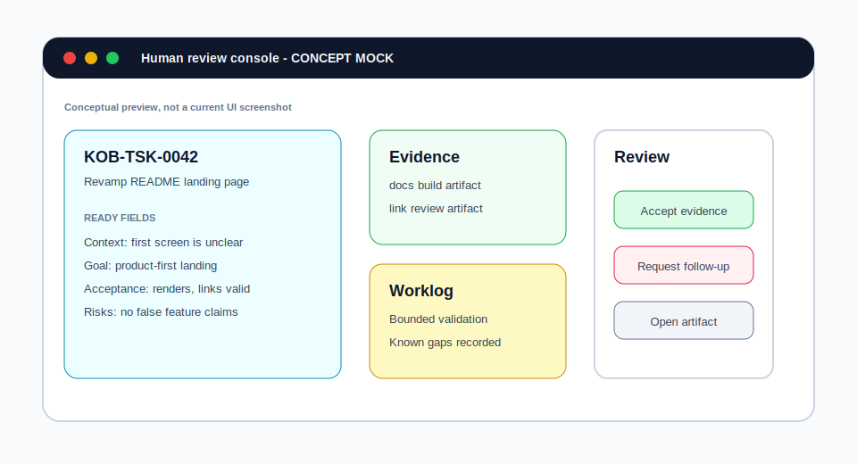

# Kano Agent Backlog Skill

**Evidence-first, repo-native Intent Engineering for AI coding agents.**

KOB turns messy human requests into durable Markdown work items with Ready gates,
worklogs, ADRs, and validation evidence so humans and agents can review the same
source of truth.



> This file is the GitHub Pages home page source. If you are browsing the
> repository directly, use
> [docs/README.md](https://github.com/kanohorizonia/kano-agent-backlog-skill/blob/main/docs/README.md)
> for repo-local links.

## Problem

AI coding agents can produce convincing reports. That does not make the work
true.

Without a durable repo-native intent layer, the important parts of the request
drift out of view: why the work exists, what acceptance criteria would prove it,
which risks were known, which validation actually ran, and what the next human or
agent should trust.

## Solution

KOB treats agent work as a falsifiable contract:

```text
human intent -> acceptance criteria -> bounded agent work -> validation artifact -> worklog evidence -> human review -> Done
```

The durable artifact is a Markdown work item in the repository. It carries the
Context, Goal, Approach, Acceptance Criteria, Risks, Worklog, ADR/Decision links,
and evidence trail across agent sessions.

## Evidence-first Intent Engineering

> A claim that cannot be falsified is not evidence.

KOB does not treat repeated agent loops as proof. It keeps validation bounded and
claim-driven: identify the claim, define how it could fail, run the relevant
check, attach or cite the artifact, and record the result in the worklog. Claims
without proof stay labeled as planned, hypothesis, design intent, opinion, or
future work.





## 60-second demo

From a cloned repository:

```bash
pixi run build-dev
bash scripts/kob admin init --product my-app --agent local-agent
bash scripts/kob item create --type task --title "Add login" --product my-app --agent local-agent \
  --duplicate-search-query "Add login" --duplicate-search-scope my-app --duplicate-decision create
```

Expected generated path:

```text
_kano/backlog/products/my-app/items/task/0000/<ID>_add-login.md
```

Open the Markdown file and fill the Ready fields before implementation starts.
Those fields become the human-reviewable contract for the agent.

## Core workflow

1. Capture human intent in a durable work item.
2. Fill the Ready gate: context, goal, approach, acceptance criteria, and risks.
3. Execute bounded agent work against that item.
4. Validate claims with commands, reports, artifacts, screenshots, or reviews.
5. Record the evidence and known limitations in the Worklog.
6. Move to Review when the evidence chain exists.
7. Close only when human review accepts the evidence.





## Backboard preview

Backboard is the local read-only review surface for backlog state. The host path
builds the native KOB Webview runtime and serves Backboard on the workstation:

```bash
pixi run webview
```

The Docker path builds the image, starts a restartable container, and opens the
same local URL:

```bash
pixi run webview-docker
```

The CLI shortcut `kob gui` runs the same Docker path. Stop the container with
`pixi run webview-docker-down`.

For deterministic repo-local smoke evidence, run:

```bash
pixi run webview-smoke-artifacts
```

The command stores `_ws/test-output/webview-smoke/root.html`,
`_ws/test-output/webview-smoke/healthz.txt`,
`_ws/test-output/webview-smoke/items-all-limit-10.json`, and
`_ws/test-output/webview-smoke/manifest.txt`. Set
`KANO_WEBVIEW_SMOKE_BASE_URL=http://127.0.0.1:8799` to reuse an already running
service; otherwise the script starts a local host with `KANO_WEBVIEW_OPEN=0`
and shuts it down after capture. If `8799` is already occupied and should not be
reused, set `KANO_WEBVIEW_SMOKE_PORT` to a free port first.

The image below is a concept mock for a future review-console style workflow,
not a current UI screenshot.



## What this is

- repo-native intent and evidence layer
- durable Markdown work items
- Ready gate and Done gate workflow
- append-only worklog and evidence trail
- ADR and decision links for durable rationale
- human-reviewable agent work contract
- native C++ CLI with repo-local launchers

## What this is not

- not a general-purpose issue tracker
- not a project-management suite
- not a chat memory layer
- not a model runtime
- not an agent scheduler
- not a CI replacement
- not magic autonomous management

## Start here

| I want to... | Go to |
| --- | --- |
| Understand the concept | [README landing page](skill/readme.md) |
| Try it locally | [Quick start](guides/quick-start.md) |
| Use it with agents | [Agent quick start](guides/agent-quick-start.md) |
| Learn commands | [CLI reference](cli/commands.md) |
| Review architecture | [Workflow reference](references/workflow.md) and [schema reference](references/schema.md) |
| Maintain releases | [Maintainer guide](automation/maintainer-automation.md) |

## Current status

| Area | Current status |
| --- | --- |
| Product | `kano-agent-backlog-skill` |
| CLI | `kob` / `kano-backlog` |
| Runtime | Native C++ CLI through repo-local launchers after local build |
| Development line | `0.0.5` Intent Engineering feature wave |
| Release line | `0.0.4` native C++ release target |
| Public release source | [GitHub Releases](https://github.com/kanohorizonia/kano-agent-backlog-skill/releases) |
| Public reports | [Latest test report](reports/latest/test-report/) and [latest coverage report](reports/latest/coverage-report/) |
| Backboard | Local read-only review surface through the KOB Webview runtime; review-console image above is conceptual |
| Package channels | Manual artifacts are release-gated; winget, Homebrew, and apt are not live unless release metadata says so |
| Retired runtime | Python runtime and Python package publishing are retired for this milestone |
| Stability | Pre-1.0; schema, CLI details, and docs can still change |

## Full docs links

| Area | Links |
| --- | --- |
| Core guides | [Quick start](guides/quick-start.md), [Agent quick start](guides/agent-quick-start.md), [Usage examples](guides/usage-examples.md) |
| Workflow | [Worksets](guides/workset.md), [Topics](guides/topic.md), [Workflow reference](references/workflow.md) |
| CLI and API | [CLI reference](cli/commands.md), [API overview](api/overview.md), [Native executable API](api/native.md) |
| Release channels | [Installation](guides/installation.md), [Release channels](guides/release-channels.md), [Release notes](releases/0.0.4.md), [Changelog](releases/changelog.md) |
| Testing | [Latest public test report](reports/latest/test-report/), [Latest public coverage report](reports/latest/coverage-report/), [GitHub Actions](https://github.com/kanohorizonia/kano-agent-backlog-skill/actions) |
| Tokenizer adapters | [Quick start](guides/tokenizer-quickstart.md), [Overview](guides/tokenizer-adapters.md), [Configuration](guides/tokenizer-configuration.md), [CLI](guides/tokenizer-cli-reference.md), [Troubleshooting](guides/tokenizer-troubleshooting.md), [Performance](guides/tokenizer-performance.md) |
| Maintainers | [Maintainer automation](automation/maintainer-automation.md), [Docs pipeline](automation/docs-pipeline.md), [Native CLI direction](guides/native-cli-direction.md), [Backboard IA](design/backboard-information-architecture.md), [Actor aliases](design/actor-alias-and-assignment-policy.md) |
| Taxonomy | [Canonical backlog taxonomy](design/canonical-backlog-taxonomy.md), [Project model decision](design/project-model-decision.md), [Hierarchy validation matrix](design/hierarchy-validation-matrix.md) |
| Product Memory | [Product Map](design/product-map-projection-schema.md), [ADR lifecycle](design/adr-lifecycle-metadata.md), [Feature evolution](design/feature-evolution-event-model.md), [Design-history graph](design/design-history-graph-edge-semantics.md) |
| Roadmap and recovery | [Version Goal Ledger](design/version-goal-ledger-schema.md), [Evidence quality](design/evidence-quality-classification-model.md), [Context recovery](design/context-recovery-summary-contract.md) |
| Reference | [Schema reference](references/schema.md), [All references](references/) |

## Release and evidence notes

Release review starts from generated evidence, but evidence is no longer the
first human entry point. The public site keeps stable report slots so reviewers,
users, and agents can inspect what was tested without opening internal systems
first.

| Evidence | Public entry point | What to verify |
| --- | --- | --- |
| Feature-first test report | [Latest public test report](reports/latest/test-report/) | Overall result, platform lanes, feature suites, and BDD scenario pages. |
| Source-level coverage report | [Latest public coverage report](reports/latest/coverage-report/) | Native coverage by file and function. Source is publishable because this project is open source. |
| Cloud build evidence | [GitHub Actions runs](https://github.com/kanohorizonia/kano-agent-backlog-skill/actions) | Cloud platform build, test, report, and Pages artifact history. |

The test and coverage links must not be placeholder-only pages for an accepted
release. If either public slot says that no publishable report HTML is available,
treat it as a release evidence blocker.

## Maintainer details

The docs build keeps the existing Quartz plus MkDocs hybrid. Local runs stop at
build and staging by default. The repository still supports branch-based
`gh-pages` publishing through `src/shell/docs/`, and that flow restores the
`CNAME` file from docs build config so the custom domain stays attached.

This project is preparing the `0.0.4` native C++ release line. The repo-local
executable contract is native only; Python package entrypoints and PyPI
publishing are retired for this release line.
