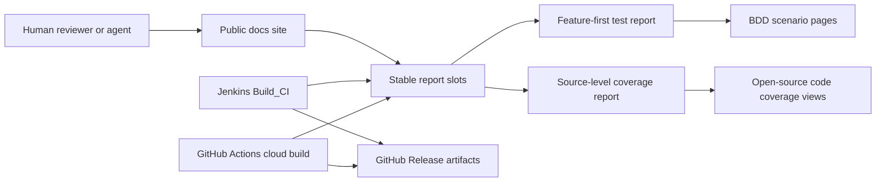
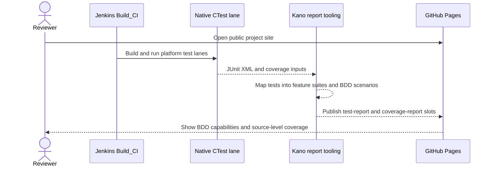
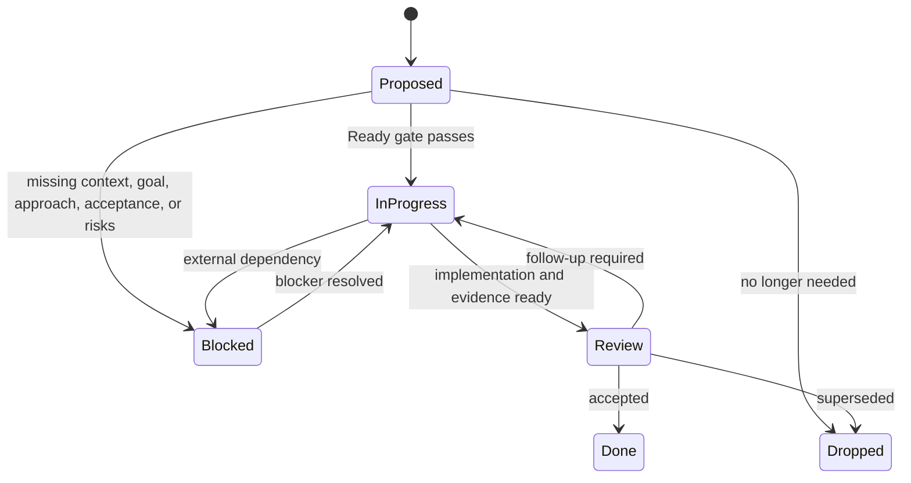
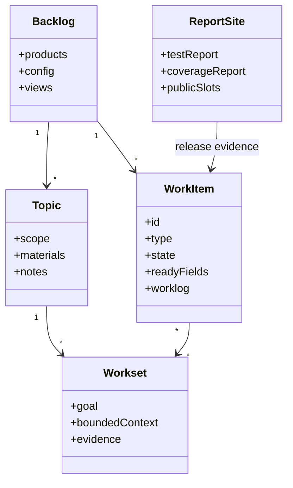

# Kano Agent Backlog Skill Technical Release

> Kano Agent Backlog Skill is local-first backlog tooling for agent-driven software work. It keeps durable work items, worklogs, ADRs, release evidence, and reviewable automation output in ordinary repository files.

> This file is the GitHub Pages home page source. If you are browsing the repository directly on GitHub, use [docs/README.md](README.md) for repo-local links.

## Publish identity

| Field | Value |
| --- | --- |
| Product | `kano-agent-backlog-skill` |
| CLI | `kob` / `kano-backlog` |
| Current release line | `0.0.4` native C++ |
| Source repository | [kanohorizonia/kano-agent-backlog-skill](https://github.com/kanohorizonia/kano-agent-backlog-skill) |
| CI workflow | [KanoAgentSkills / Cloud Build](https://github.com/kanohorizonia/kano-agent-backlog-skill/actions/workflows/agent-skill-cloud-build.yml) |

## CI evidence to review first

Release review starts from generated evidence. The public site keeps stable report slots so reviewers, users, and agents can inspect what was tested without opening Jenkins internals first.

| Evidence | Public entry point | What to verify |
| --- | --- | --- |
| Feature-first test report | [Latest public test report](https://agentskill-backlog.kanohorizonia.com/reports/latest/test-report/) | Overall result, platform lanes, feature suites, and detailed BDD scenario pages. |
| Source-level coverage report | [Latest public coverage report](https://agentskill-backlog.kanohorizonia.com/reports/latest/coverage-report/) | Native coverage by file and function. Source is publishable because this project is open source. |
| BDD capability tour | [BDD scenarios inside the latest test report](reports/latest/test-report/) | User-facing behavior coverage: repo discovery, work item creation, state transitions, topics, worksets, and release/report contracts. |
| GitHub cloud evidence | [GitHub Actions runs](https://github.com/kanohorizonia/kano-agent-backlog-skill/actions) | Cloud platform build and report artifact history. |
| Jenkins release evidence | [KanoAgentSkills latest Build_CI](https://jenkins.kanohorizonia.com/job/KanoAgentSkills/job/kano-agent-backlog-skill/job/Build_CI/lastSuccessfulBuild/) | Internal orchestration, artifact collection, report publication, and release gates. |

The test and coverage links must not be placeholder-only pages for an accepted release. Do not send external users to local Jenkins URLs; Jenkins report pages are internal producer evidence, and GitHub Pages report slots are the public consumer contract. If either public slot says that no publishable report HTML is available, treat it as a release evidence blocker.

## BDD as product documentation

The test report is also the product tour. Feature suites should read like externally useful capability documentation, while the individual BDD scenarios provide the exact behaviors that were exercised by CI.

| Feature suite | What a reader should learn |
| --- | --- |
| CLI core | How `kob` discovers a backlog, parses commands, exits noninteractively, and reports user-facing failures. |
| Repo discovery | How the tool locates the nearest backlog root and keeps local-first operation stable across nested workspaces. |
| Work item operations | How items are created, assigned stable IDs, written to ordinary files, and transitioned through the Ready gate. |
| Topics and worksets | How agents gather bounded context, assemble focused work orders, and avoid broad workspace assumptions. |
| Report publication | How Jenkins and GitHub Actions publish JUnit, feature-first HTML, coverage HTML, and public site report slots. |
| Release channels | How GitHub Releases, Homebrew, winget, apt intent payloads, and post-release install checks fit together. |

## Start here

| Destination | Why open it |
| --- | --- |
| [Quick start](guides/quick-start.md) | Install and run the backlog CLI in a local repo. |
| [Release downloads](https://github.com/kanohorizonia/kano-agent-backlog-skill/releases/latest) | Download installable platform artifacts from the latest GitHub Release. |
| [Installation](guides/installation.md) | Manual archive install and package-manager channel status. |
| [CLI reference](cli/commands.md) | Generated command surface for `kob`. |
| [Release 0.0.4 notes](releases/0.0.4.md) | Native C++ release scope and channel notes. |
| [Release channels](guides/release-channels.md) | How CI, GitHub Releases, Homebrew, winget, and apt publishing are intended to work. |
| [Architecture decisions](adr/overview.md) | Backlog model, ID policy, indexing, and local-first decisions. |
| [GitHub Actions](https://github.com/kanohorizonia/kano-agent-backlog-skill/actions) | Current cloud build, test, report, and Pages runs. |

## Release quality snapshot

| Signal | Current release policy |
| --- | --- |
| Required platform | Windows x64 |
| Optional cloud platforms | Windows arm64, Linux x64, Linux arm64, macOS x64, macOS arm64 |
| Test lane | Full native CTest lane with JUnit output |
| Public test report | Feature-first HTML report plus BDD scenario pages |
| Coverage report | Public source-level coverage is allowed for this open-source project |
| Package artifacts | Native CLI payloads must be downloadable from GitHub Releases before a version is accepted |

## Feature highlights

| Area | What the automation validates |
| --- | --- |
| Backlog core | Config loading, frontmatter parsing, state model behavior, and file layout contracts. |
| Workitem operations | Canonical item creation, IDs, templates, and repo-backed persistence. |
| CLI workflow | Repo-root discovery, noninteractive execution, topic/workset flows, and user-facing command behavior. |
| Release automation | Jenkins and GitHub Actions generate platform artifacts, test reports, coverage reports, and package-manager metadata. |

## What this site covers

This site brings together release-facing documentation, generated CLI docs, architecture decisions, release notes, and the CI report contract used by Jenkins and GitHub Actions. CI report pages are expected to expose both test detail and coverage detail because the project is open source.

## Architecture overview

## Core guides

- [Quick start](guides/quick-start.md)
- [Agent quick start](guides/agent-quick-start.md)
- [Worksets](guides/workset.md)
- [Topics](guides/topic.md)
- [Usage examples](guides/usage-examples.md)

## Tokenizer adapters

- [Tokenizer quick start](guides/tokenizer-quickstart.md)
- [Tokenizer adapters overview](guides/tokenizer-adapters.md)
- [Tokenizer configuration](guides/tokenizer-configuration.md)
- [Tokenizer CLI reference](guides/tokenizer-cli-reference.md)
- [Tokenizer troubleshooting](guides/tokenizer-troubleshooting.md)
- [Tokenizer performance](guides/tokenizer-performance.md)

## Maintainers

The docs build keeps the existing Quartz plus MkDocs hybrid. Local runs now stop at build and staging by default. The repository currently supports branch-based `gh-pages` publishing through `src/shell/docs/`, and that flow restores the `CNAME` file from docs build config so the custom domain stays attached.

This project is currently preparing the `0.0.4` native C++ release. The repo-local executable contract is native only; Python package entrypoints and PyPI publishing are retired for this release line.
